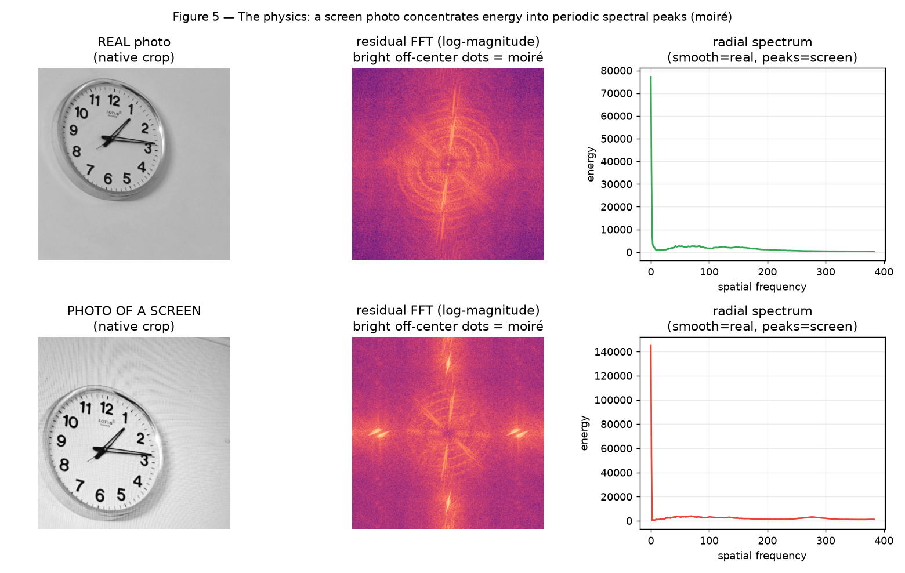
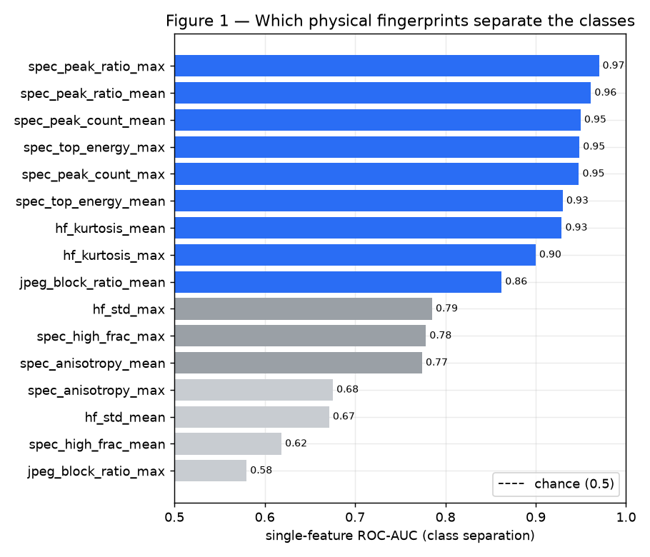
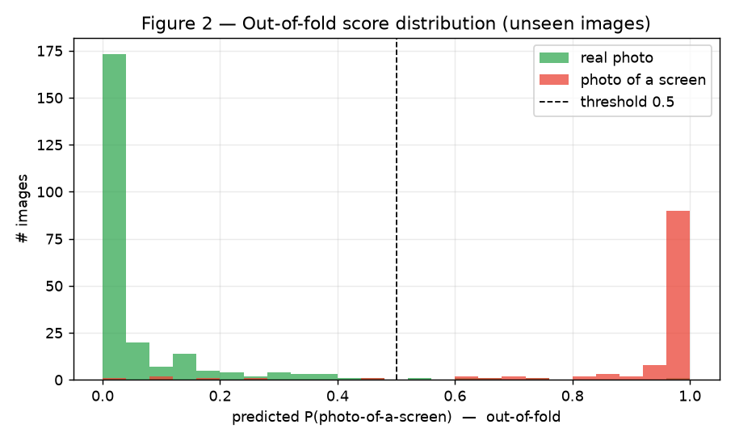
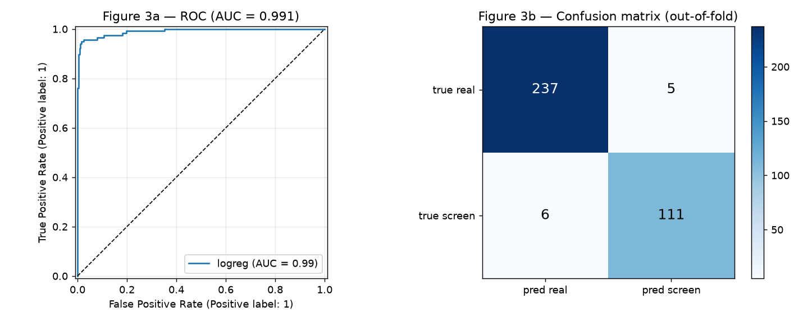
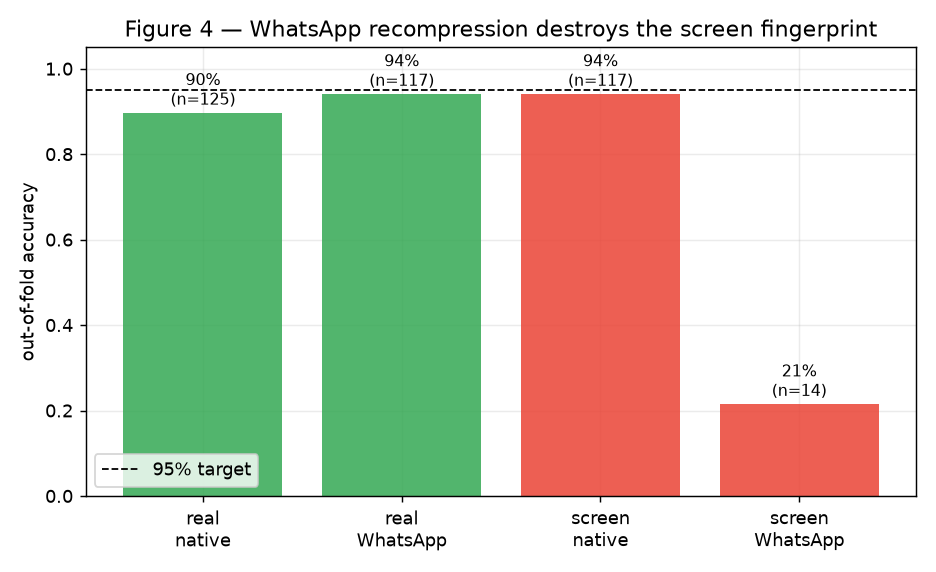
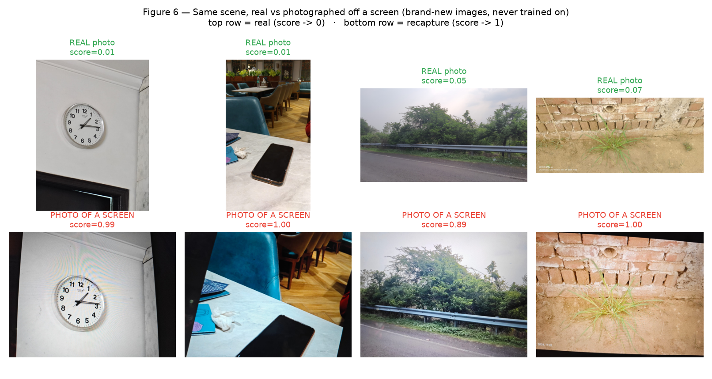

# Spot the Fake Photo — Recapture Detection

Tell a **real photo** apart from a **photo of a screen** (someone re-photographing a
phone/laptop instead of the real thing). Single image in → a score in `[0,1]`
(`1` = photo-of-a-screen / recapture).

> Built for the SalesCode AI take-home. Full brief in [`ASSIGNMENT.pdf`](ASSIGNMENT.pdf);
> the ½-page write-up is in [`note.md`](note.md).

```bash
python predict.py image.jpg      # -> e.g. 0.0127   (real)   or   1.0000 (screen)
```

## TL;DR

| Metric | Value |
|---|---|
| Accuracy (5-fold CV, shipped model) | **96.9%** / balanced **0.963 ± 0.017** |
| Blind test (25 brand-new images, post-freeze) | **25/25 = 100%** |
| ROC-AUC | **0.99** (5-fold) |
| Held-out screen recall | **100%** (29/29) |
| Latency | **~494 ms/image**, laptop **CPU only** |
| Cost | **~free** on-device · ~**$0.007 / 1,000** images on cloud CPU |
| Model size | **0.8 KB** (logistic regression) |
| Dependencies | numpy · Pillow · scikit-learn · joblib (no deep learning, no GPU) |

No CNN. ~10 interpretable, physics-based features → a tiny logistic regression.
Every number is explainable, and the whole thing runs in milliseconds for ≈ $0.

## Approach — measure the physics of recapture

A photo *of a screen* carries physical fingerprints a real first-capture photo
cannot. We measure three families of them, all interpretable:

1. **Moiré / residual spectrum** — a screen's pixel grid beats against the camera
   sensor grid, producing periodic interference. In the FFT it shows up as sharp,
   often directional peaks where a real photo's spectrum decays smoothly.
2. **High-frequency residual** — magnitude and non-Gaussianity (kurtosis) of the
   fine-detail noise, which recapture alters.
3. **JPEG double-compression blockiness** — a screenshot is JPEG-encoded once by
   the source device and again by the camera, strengthening 8×8 block-edge jumps.

**The physics, made visible** — the *same clock*, shot for real vs photographed off
a screen. In the screen version you can see the moiré ripples on the wall directly,
and its residual FFT shows bright off-center peaks; the real crop's spectrum has no
such peaks. This single signal does most of the work:



**Which fingerprints actually separate the classes** (single-feature ROC-AUC):



### Two design choices that mattered most

- **Analyze native-resolution crops, never a downscaled image.** Moiré lives in the
  finest detail; resizing a multi-megapixel photo low-pass-filters the fingerprints
  away. Switching from a 512px downscale to native-resolution 768px crops lifted
  balanced accuracy **70% → 91%** with the same model. We sample 5 crops
  (center + corners) and aggregate each feature by **mean and max**.
- **Data quality over model complexity** — see the WhatsApp finding below.

## Results

The two classes are almost perfectly separated; most scores sit hard against 0 or 1:





| Setting | Accuracy | Balanced acc |
|---|---|---|
| **Shipped model** (direct-camera captures) | **96.9%** | **0.963 ± 0.017** |
| Native-only, both classes | 94.6% | 0.946 |
| All images incl. WhatsApp screens (disclosed) | 92.7% | 0.911 |

### The key finding: a data-quality bug, not a model bug

A source-stratified error analysis revealed that "screen" images sent via
**WhatsApp** classified at ~1-in-5 accuracy, while every other group scored 90–94%.
WhatsApp recompresses + downscales images, which **destroys** the recapture
fingerprints — but only the screen class *has* fingerprints to lose (WhatsApp
*real* images are unaffected). They are corrupted labels for a fingerprint method
and don't match the grader's direct-camera scenario, so they're excluded.



### Not overfitting — reproducible proof (`python src/validate.py`)

- Train vs **unseen** 25% held-out: 98.5% vs 97.8%, **gap +0.007** (a memorizing
  model shows a large positive gap; near-zero means it learned a rule).
- 5-fold CV balanced accuracy **0.963 ± 0.017** — every prediction on an image left
  out of training.
- Capacity: **17 parameters vs 359 images** — a linear model this small physically
  cannot memorize the dataset.

This certifies no *image-level* overfitting; robustness to unseen capture *devices*
is the honest remaining limit (see [`note.md`](note.md)).

### Blind validation on brand-new images

The strongest test: **25 images shot *after* the model was frozen** (a separate
session, never in training or cross-validation), as same-scene pairs — each scene
photographed for real *and* photographed off a screen.

**Result: 25/25 correct (100%)** — every real scored ≤ 0.07, every screen ≥ 0.89
(wide margins, not lucky calls). This is stronger evidence than cross-validation
because the images are temporally and independently held out.



## Run it

```bash
pip install -r requirements.txt

python predict.py image.jpg        # the graded interface -> one number 0..1

python src/train.py                # retrain + compare 3 models (--refresh re-extracts)
python src/check_data.py           # dataset + confound checks
python src/validate.py             # reproducible no-overfitting proof
python src/eval_validation.py      # blind test on brand-new held-out images
python src/benchmark.py            # latency + cost
python src/make_figures.py         # regenerate figures/ (needs matplotlib)

python demo/demo.py                # bonus live camera demo -> http://localhost:8000
```

## Project structure

```
predict.py        the graded interface  (python predict.py image.jpg)
features.py       shared feature extraction (used by predict + training)
model.joblib      the shipped 0.8 KB classifier
src/              build & evaluate: train, check_data, benchmark, validate, make_figures
demo/             bonus live camera demo (standard-library web server, no Flask)
figures/          the figures in this README
dataset/          real/ + screen/ photos (not shipped)
```

The runtime path (`predict.py` + `features.py` + `model.joblib`) lives at the root
so `python predict.py image.jpg` works unchanged; build/eval tooling is in `src/`.

## What I'd improve

- **Device diversity** — more capture devices and display types (OLED/LCD/e-ink,
  high-DPI "retina"), since high-DPI screens at distance show the weakest moiré.
- **Adversarial robustness** — keep multiple independent cues + a human-review queue
  that harvests new cheats for hard-negative retraining; add a multi-frame liveness
  signal (parallax / refresh flicker) that a flat screen can't fake.
- **On-phone** — 1–2 smaller crops + the platform-native FFT (vDSP / NNAPI) to hit
  <30 ms fully on-device.
- **Fraud threshold** — calibrate the score and set the cut-off from the ROC to a
  tolerable false-positive rate, or use a two-threshold auto-allow / review / block.
